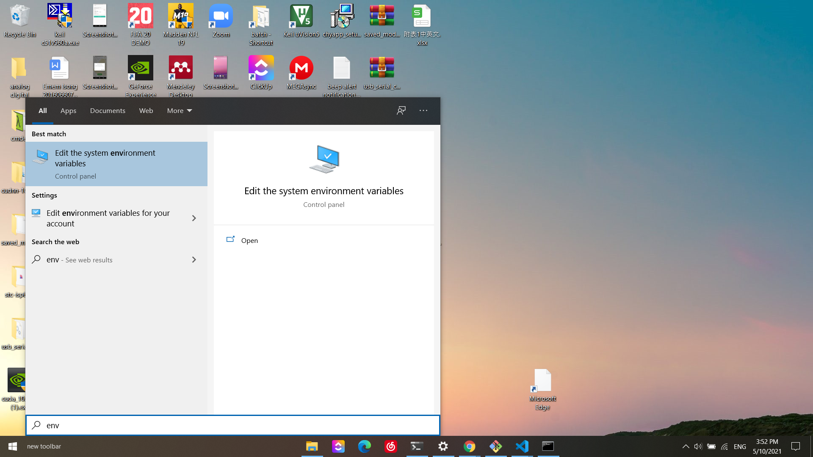
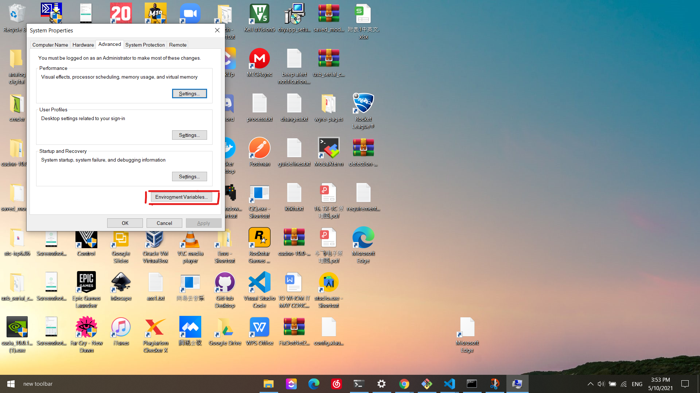
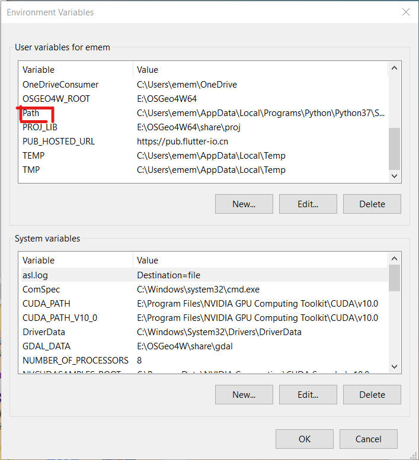
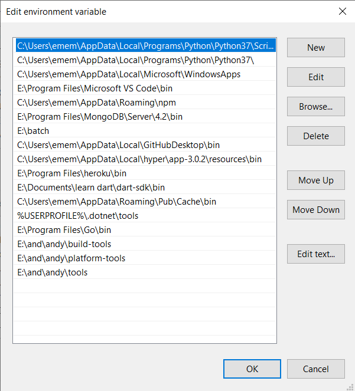
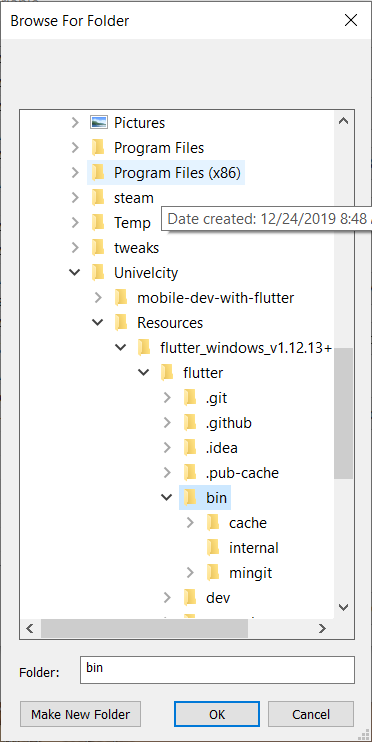

# Flutter Installation For Windows

1. Download and install android studio from (https://developer.android.com/studio)

2. Download the flutter sdk from (https://flutter.dev/docs/get-started/install/windows)

3. Unzip the fluttter sdk.

4. Add flutter to the enviroment path.

5. run the command `flutter doctor licenses`.

6. run command `flutter doctor`

7. open vscode and install flutter extension.

8. press `ctrl+shift+p` a menu will appear from the top bar, afterwards type in flutter.

9. choose the flutter create new application option

10. input a name for the application.

11. your flutter project will be created

